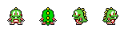

<link rel="stylesheet" href="readme.css">

# Projet Bomberman

**Guillaume Lochon**
**Jihane Lakhal**
**Groupe 32**

## Fonctionnalités 

Toutes les fonctionnalités demandées sont là :

Les monstres se déplacent aléatoirement. Leur vitesse augmente au fur et à mesure des niveaux
Les bombes explosent correctement, leur portée peut être modifiée. L’explosion d’une bombe déclenche l'explosion d’une seconde si elle est dans le souffle de la 1ère. Les box, arbres et rochers bloquent l’explosion dans une certaine direction.L’explosion tue les monstres et donne des dégâts au joueur
Tous les malus ont une action. La partie se termine si les vies du joueur sont nulles ou si le joueur touche la princesse.

## Ajouts supplémentaires

Sprite Joueur : Ses contours sont dorés les 3 premières secondes de chaque niveau. C’est sa durée d'invincibilité. On a
pris la liberté de créer 4 nouveau visuels dérivés de l’image initiale

Sprite Monstres : Les monstres sont différents entre chaque niveau. Plus il est élevé, plus le monstre est coloré rouge.
Il y a 7 nouveaux visuels.

## Améliorations à faire :

Si une bombe est posée avant un changement de niveau, elle explose dans le nouveau niveau. C’est à corriger
Implémentation d’un système de déplacement des monstres en fonction de la position du joueur. Les déplacement actuels
sont erratiques 
